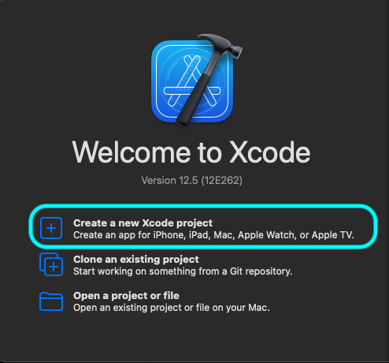
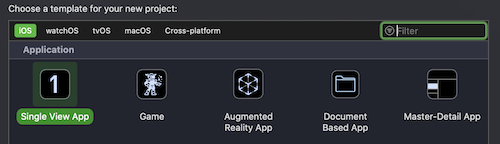
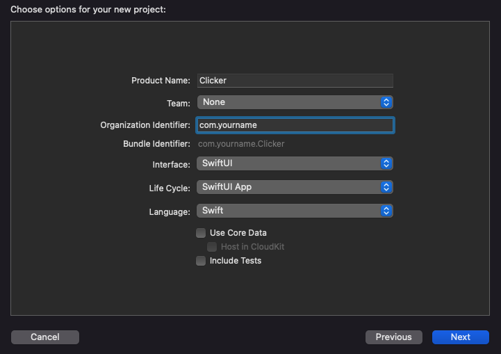
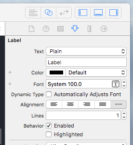
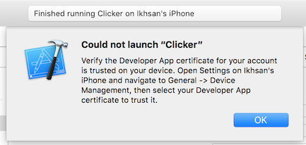

This tutorial is an intro to the world of iOS development using Apple's latest UI framework: [SwiftUI](https://developer.apple.com/xcode/swiftui/)

We'll be building a counter app, where the user will press a button and increment the number on the screen.

## Pre-requisites

In order to work through this tutorial, you will need a Mac with Xcode 11 installed. Xcode 11 is the minimum version that supports SwiftUI. It is useful to have Mac OSX Catalina installed to see live previews in Xcode, but you can still use Mac OSX Mojave.

Download and install Xcode from the App Store. This may take a while — its a big program. If you are at a Codebar ask the coaches before downloading it from the App Store as they frequently have a copy on a USB drive which will save installation time.

## Creating a Project

### 1. Open Xcode and click Create a new Xcode project



### 2. Select Single View Application from the **iOS > Application list**, and click **Next**

  

### 3. Fill in the project details:

  * Product Name: Clicker
  * Team: None
  * Organization Name: Whatever you want — your name is always a good fill-in
  * Organization Identifier: com.(OrganizationName)

  Make sure Swift is selected as the language.
  
  Make sure SwiftUI is selected as the User Interface.

  Untick the 3 boxes at the bottom.

  Click Next

  

### 4. Select a sensible place to save your project, then hit **Create**.

  Take some time to look around the project that's been created with your coach. What files are there? How do you run your app?
  
  If you are running Mac OS X Catalina, try running the preview to see what the default project provides.

## Build a Button

### 1. Open up the **Navigation Area** in Xcode, and open up the `Main.storyboard` file.

  > A storyboard is a visual representation of the user interface of an iOS application. It's one of the ways we can create our user interface (the visual bit of an app).

  

### 2. Now, click on the **Object Library** next to the **Standard Editor**. In the search box, find a button, and drag it to the bottom of the view shown in the storyboard.

  

### 3. Run your app on the iPhone 7 Plus Simulator. See your button, there in all its glory at the bottom of the screen. Go ahead - press it!

  Celebrate appropriately.

### 4. However, it would be even more awesome if our button actually did something.

  To do this we're going to need more than just our storyboard - we'll need a **View Controller**.

  > View controllers are the foundation of your app’s internal structure. Every app has at least one view controller, and most apps have several. Each view controller manages a portion of your app’s user interface as well as the interactions between that interface and the underlying data.

  Think of the view as the puppet, and the view controller as the puppet master. Without something pulling the strings, the view is just a lifeless doll. And without the puppet, the puppet master is just someone doing silly voices to empty air.

### 5.  Open the `ViewController.swift` file in the **Assistant Editor**. If it's not automatically there when you open the **Assistant Editor**, select it from the automatic or manual routes in the file navigator.

  

### 6. Let's take a quick look at the code in `ViewController.swift`

  At the top there's some general information on the file and copyright. This is added in every new file you create in Xcode, and you can ignore it.

  Next we import UIKit into this file. UIKit is a framework provided by Apple to help you build iOS apps. It defines the core components - such as `UIButton` (like the one we've added to our storyboard) and `UIViewControllers`, which we're about to use.

  Now onto the interesting bit. This code is creating a new **View Controller** - imaginatively called `ViewController`, and declared it as a type of `UIViewController` - which means it inherits all the useful things a view controller can do.

  There's also 2 functions inside the `ViewController` - `viewDidLoad()` and `didReceiveMemoryWarning()`. We don't actually need these right now, so go ahead and delete them.

  Now our `ViewController` should look like this:


  ```swift
  import UIKit

  class ViewController: UIViewController {


  }
  ```

### 7. Hold down the **ctrl** button on your keyboard, then click and drag from the button in your storyboard into the `ViewController` code - on an empty line between the `{  ... }`

  In the pop-up that appears:
  * Set the **Connection Type** to be `Action`
  * Type the **Name** of the function as `buttonTapped`

  Hit **Connect**

  

  This has created an `IBAction` - which is a function in your code that is triggered by an action in your storyboard.

### 8. Let's see if our button works!

  First, in the body of the `buttonTapped` function let's add a print statement:

  ```swift
  @IBAction func buttonTapped(_ sender: Any) {
      print("Hello, world")
  }
  ```

### 9. Run your app in the iPhone 7 Plus simulator again, and tap on the button.

  

  You should see your message appear in the console!

  /giphy Celebrate

## Count the Clicker

### 10. Time to build our clicker.

  As you did with the button, find a `Label` from the `Object Library` and drag it onto the storyboard, in the middle of the view. (Please note the location of the Object library has changed for Xcode 10!)

  (If you need to check back to Step 2 of this tutorial for a reminder of how to do this)

### 11. The text of the label is a little small. Head over to **Attributes Inspector** in the **Utility Area** (right hand pane).

  

  Increase the font size to 100pt. The original size of the label is now laughably small for our epic font size, so now drag the corners to make it big enough.

  

### 12. Set the text alignment of your label to be `Centered` - it's in the same place as you set the font size.

### 13. Now, let's create a link between our label and the `ViewController`.

  We do this using an `IBOutlet`, and it's created the same way as the `IBAction` we used to link our button to the `ViewController`.

  Give it a try - look back at Step 7 if you need to.

  When the popup appears:
    * Set the **Connection Type** to `Outlet`
    * Give it the name `counterLabel`

  Your `ViewController` should now look like this:

  ```swift
    import UIKit

    class ViewController: UIViewController {

      @IBOutlet weak var counterLabel: UILabel!

      @IBAction func buttonTapped(_ sender: Any) {
        print("Hello, world")
      }

    }
  ```

### 14. Next we want to get actions on our button changing the appearance of our label.

  Inside of your `buttonTapped` function add the following line:

  `counterLabel.text = "🙌"`

  (Hint: To bring up the emoji keyboard, hit **ctrl** + **cmd** + **space**)

  Run your app, and hit that button, and (fingers crossed) see your emoji appear.

## 3 ... 2 ... 1 ... 🚀

### 15. Finally, let's make the counter increment (goodbye emojis, for now).

  For this, our ViewController is going to need a local variable. Add this line to the top of your `ViewController`:

  `var counter = 0`

  This will keep count of the taps on our button.

### 16. Now, let's hook up our button and our counter.

  Inside the `buttonTapped` method, increment the counter:

  `counter += 1`

### 17. The final step is to make the label show the latest value of the counter.

  First, delete the placeholder text "Label" from your label in the storyboard, and replace it with `0`.

  Then in the `buttonTapped` method replace the emoji inside the `"..."` with:

  `"\(counter)"`

  And ... run your app!

  

## Bonus : Run your app on your Apple device

Running your app in the simulator is cool, but you know what's even cooler? Running your app in your Apple devices! Couple years back, you need to have a developer account to run your app in a physical device, but luckily know Apple allows us to run our app using your everyday Apple account.

### Pre-requisites

- 📱 Apple device (the more recent device the better) + cable
- An Apple account

### A. Add your account in Xcode

- From the menubar, go to `Xcode > Preferences...`
- Click the `Accounts` tab (the second tab)
- On bottom left, press the + icon
- Select `Add Apple ID...`
- Insert your Apple ID's credentials


### B. Configure your project's signing

- Go to `Navigator` area, select `Project navigator` tab, select your project name
- Select your app target in the `Targets` tab
- In the `Signing` area, select your account as the team name


### C. Configure your device 📱

- Plug your Apple device to your development machine (this will trigger Xcode to [processes symbol files from your devices](http://stackoverflow.com/a/19706886/851515), which will take a sometime)
- Instead of running on simulator, select your device instead

- Press the play button to run the app!
- Errm... not so fast. We need to allow codesign to access our keychain, press `Always Allow`

- Almost there, you will be prompted to verify your account in your device

- Now on your iOS device, go to `Settings` > `General` > `Profiles & Device Management`, tap your account under `Developer App`, tap `Trust '<your apple account email>'`, and confirm by tapping `Trust` again

- Back at Xcode, press play button to build and run again
- 🎉

It's great to see that Apple makes it easy for us to try our app in our actual hands. Happy testing!

------

## Extension Tasks

If you've finished all of the above why not think about some of the following ideas:

* make a new button that decreases the button. Can you turn it into a two player game?

* make the background change after a set amount of clicks? How about creating an array of colours to change every set interval e.g. after 5 taps.

* change your button into a picture button, you could make a cookie clicker? Make the picture change after a set amount of clicks.

* check out Auto Layout with your coach. How would you go about fitting this onto an iPad versus a smallest iPhone?
