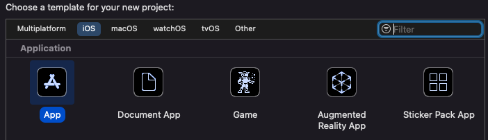
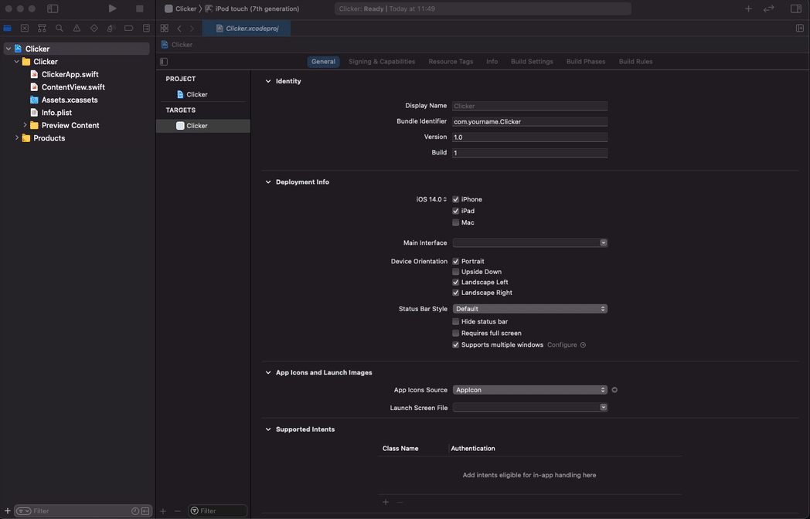
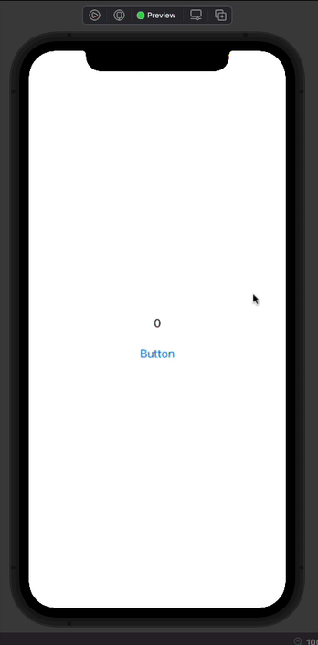
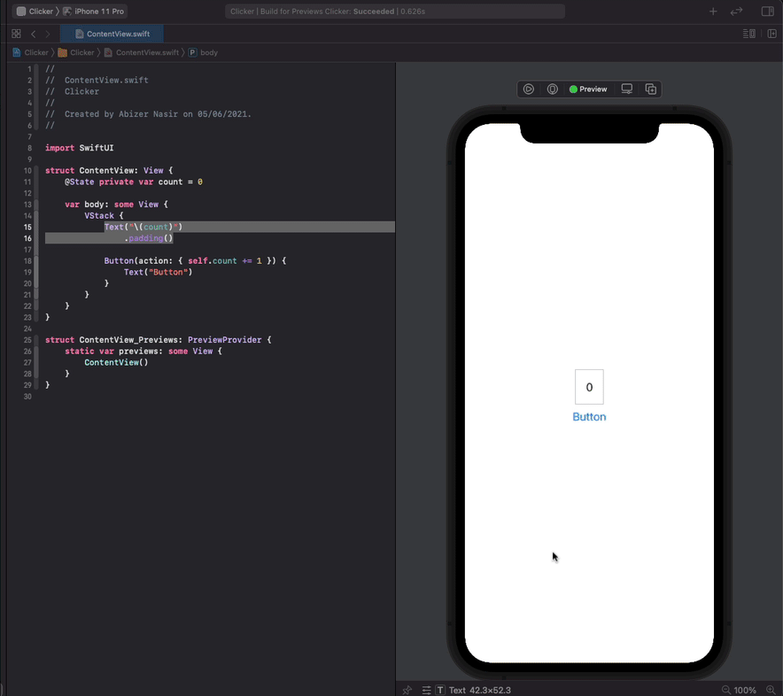
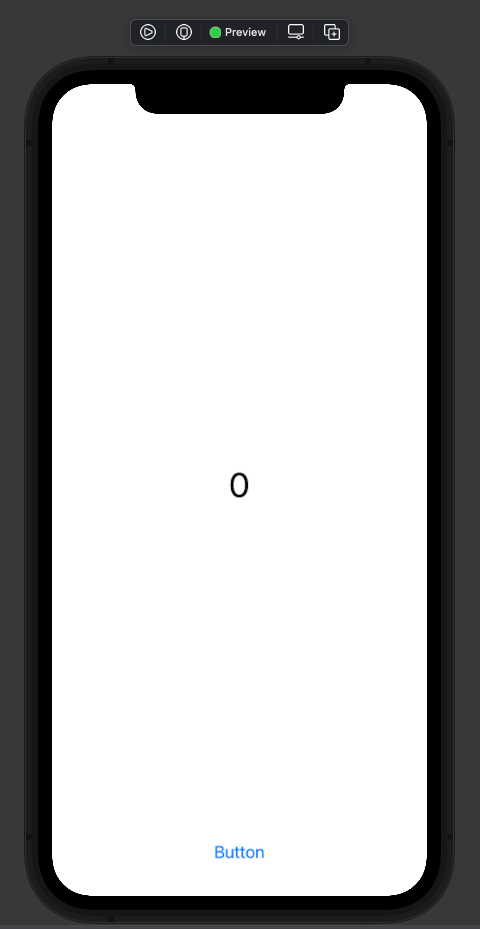

This tutorial is an intro to the world of iOS development using Apple's latest UI framework: [SwiftUI](https://developer.apple.com/xcode/swiftui/)

We'll be building a counter app, where the user will press a button and increment the number on the screen.

## Pre-requisites

In order to work through this tutorial, you will need a Mac with Xcode 11 installed. Xcode 11 is the minimum version that supports SwiftUI. It is useful to have Mac OSX Catalina installed to see live previews in Xcode, but you can still use Mac OSX Mojave.

Download and install Xcode from the App Store. This may take a while — its a big program. If you are at a Codebar ask the coaches before downloading it from the App Store as they frequently have a copy on a USB drive which will save installation time.

## Creating a Project

### 1. Open Xcode and click Create a new Xcode project


### 2. Select Single View Application from the **iOS > Application list**, and click **Next**



### 3. Fill in the project details:

- Product Name: Clicker
- Team: None
- Organization Name: Whatever you want — your name is always a good fill-in
- Organization Identifier: com.(OrganizationName)

Make sure Swift is selected as the language.
  
Make sure SwiftUI is selected as the User Interface.

Untick the 3 boxes at the bottom.

Click Next


### 4. Select a sensible place to save your project, then hit **Create**.

Take some time to look around the project that's been created with your coach. What files are there? How do you run your app?
  
If you are running Mac OS X Catalina, try running the preview to see what the default project provides.

## Add a Button

### 5. Open up the **Navigation Area** in Xcode, and then the `ContentView.swift` file and its associated Canvas.


  
If you click on the `Resume` button in the top right, and you are running Mac OS X Catalina you will see a preview of the **Hello World** application that the template has provided for you.
  
### 6. Edit the Canvas and add a Button

When using SwiftUI the Canvas provides a live view of your code. Editing the Canvas will also update your code! We shall be adding code from the Editor a little later on, but for now just add a button to the canvas.
  
- Open the Library
- Make sure you are browsing the Views
- Search for Button
- Drag the button under the label

### 

If you look at the Editor, you can see that this has created a _VStack_ with both the label and the button. A _VStack** is a built in view that arranges the contained views vertically.

### 7. Run the app on the Simulator or the canvas.

You can either run the app in the simulator or use the live preview in the Canvas to see the visual effect of pressing the button.
 
Celebrate appropriately! 

Try changing the _VStack_ to an _HStack_ Are the results what you expected?

However, it would be even more awesome if our button actually did something.

## Make the Button do something

To do this we are going to need some state in our view. SwiftUI is a _declarative_ framework. That means that you write the view to show different things according to its state, and actions change the state. Internally, SwiftUI keeps track of the state, and when it changes it redraws the view.

### 8. Create some state for the view

Create a state variable at the top of the definition of `ContentView`. We make it `private` because it is internal to the view, and we give it a default value of `false` which implicitly makes `showGreeting` a variable that holds a `Bool` (Now is the time to ask your Coach questions).

```swift
struct ContentView: View {
    @State private var showGreeting = false
    var body: some View {
    <...>
```

We are going to use this to configure what the view displays.

### 9. Configure the view to display according to the state

Change the string that is displayed in the `Text` view depending on this state:

```swift
Text(showGreeting ? "Hello CodeBar!" : "")
```

When `showGreeting` is `true` the label will display the greeting, otherwise it will be empty.

### 10. Use the Button's action to change the state

When you dragged the button onto the canvas it created an empty `action` This is a closure, and when the button is tapped it will perform whatever code is written in this closure. We are going to use this to toggle the `showGreeting` state.

Edit the Button code look like this:

```swift
Button(action: { self.showGreeting.toggle() })
```

The `ContentView` struct should now look like this:

```swift
struct ContentView: View {
    @State private var showGreeting = false
    
    var body: some View {
        VStack {
            Text(showGreeting ? "Hello CodeBar!" : "")
            Button(action: { self.showGreeting.toggle() }) {
                Text("Button")
            }
        }
    }
}
```

### 11. Run the app in the Simulator or by using the Canvas's live preview feature

As you tap the button, the greeting appears and disappears!

/giphy Celebrate


This is not trivial. You have learned an important part of developing using SwiftUI. You create state, you write your view to respond to the state, and you have actions that change the state. The framework takes care of redrawing the view when the state changes.

If you have done any iOS development before, or even the other CodeBar tutorial, you can see how little code is needed. There are no `ViewController`s. There are no `Storyboards`. You write code and see the results immediately.

 
## Make the Counter

There are two major tasks to get the make the counter app. The functionality - getting the counter to increment on button clicks and showing the new number. The UI, getting an app that looks nice and is easy to use. This tutorial will create the functionality first and then move on to the UI. You may choose to tackle the tasks in the alternate order. Have a brief discussion with your Coach about the pros and cons of each approach.

### 12. Create the Counter functionality

We are a good way towards this, we already have a `Button` with an action, and a `Text` view that displays something. 

Change the state variable to hold a number instead of a `Bool`

```swift
@State private var count = 0
```

Since the state is variable is now a number and not a string, change the `Text` view to display this:

```swift
Text("\(count)")
```

Finally change the `Button`'s action to increment this variable

```swift
Button(action: { self.count += 1 })
```

The entire file should now look like this

```swift
import SwiftUI

struct ContentView: View {
    @State private var count = 0

    var body: some View {
        VStack {
            Text("\(count)")
            Button(action: { self.count += 1 }) {
                Text("Button")
            }
        }
    }
}

struct ContentView_Previews: PreviewProvider {
    static var previews: some View {
        ContentView()
    }
}
```

### 13. Run the app in the Simulator on the Canvas live preview to see the counter working




## Make it look better

Having the button and the label so close together isn't the nicest looking UI. Nor is it the easiest to use. And the text for the counter seems a little small. Let's fix these things

### 14. Increase the size of the numbers

In the canvas Cmd + Click on the `Text` view, this brings up an inspector.

Select the `show SwiftUI Inspector...` option.

Choose `Large Title` for the font.



Notice that in the editor, the modifier has been added to the `Text` view that matches this choice.

Working with your coach, try to apply other sizes and styles to this `Text` view.

### 15. Add some spacing

Let's add some separation between the elements. `VStack`s are quite helpful in laying items out. All that needs to be done is for some spacers to be added between the elements and the it will handle layout.

Add a `Spacer()` above and below the `Text` view. The entire file should now look like this:

```swift
import SwiftUI

struct ContentView: View {
    @State private var count = 0

    var body: some View {
        VStack {
            Spacer()
            Text("\(count)")
                .font(.largeTitle)
            Spacer()
            Button(action: { self.count += 1 }) {
                Text("Button")
            }
        }
    }
}

struct ContentView_Previews: PreviewProvider {
    static var previews: some View {
        ContentView()
    }
}
```

And the Canvas shows the result:



    ----- Updated up to here -------------------


## Bonus : Run your app on your Apple device

Running your app in the simulator is cool, but you know what's even cooler? Running your app in your Apple devices! Couple years back, you need to have a developer account to run your app in a physical device, but luckily know Apple allows us to run our app using your everyday Apple account.

### Pre-requisites

- 📱 Apple device (the more recent device the better) + cable
- An Apple account

### A. Add your account in Xcode

- From the menubar, go to `Xcode > Preferences...`
- Click the `Accounts` tab (the second tab)
- On bottom left, press the + icon
- Select `Add Apple ID...`
- Insert your Apple ID's credentials


### B. Configure your project's signing

- Go to `Navigator` area, select `Project navigator` tab, select your project name
- Select your app target in the `Targets` tab
- In the `Signing` area, select your account as the team name


### C. Configure your device 📱

- Plug your Apple device to your development machine (this will trigger Xcode to [processes symbol files from your devices](http://stackoverflow.com/a/19706886/851515), which will take a sometime)
- Instead of running on simulator, select your device instead

- Press the play button to run the app!
- Errm... not so fast. We need to allow codesign to access our keychain, press `Always Allow`

- Almost there, you will be prompted to verify your account in your device

- Now on your iOS device, go to `Settings` > `General` > `Profiles & Device Management`, tap your account under `Developer App`, tap `Trust '<your apple account email>'`, and confirm by tapping `Trust` again

- Back at Xcode, press play button to build and run again
- 🎉

It's great to see that Apple makes it easy for us to try our app in our actual hands. Happy testing!

------

## Extension Tasks

If you've finished all of the above why not think about some of the following ideas:

* make a new button that decreases the button. Can you turn it into a two player game?

* make the background change after a set amount of clicks? How about creating an array of colours to change every set interval e.g. after 5 taps.

* change your button into a picture button, you could make a cookie clicker? Make the picture change after a set amount of clicks.

* check out Auto Layout with your coach. How would you go about fitting this onto an iPad versus a smallest iPhone?
