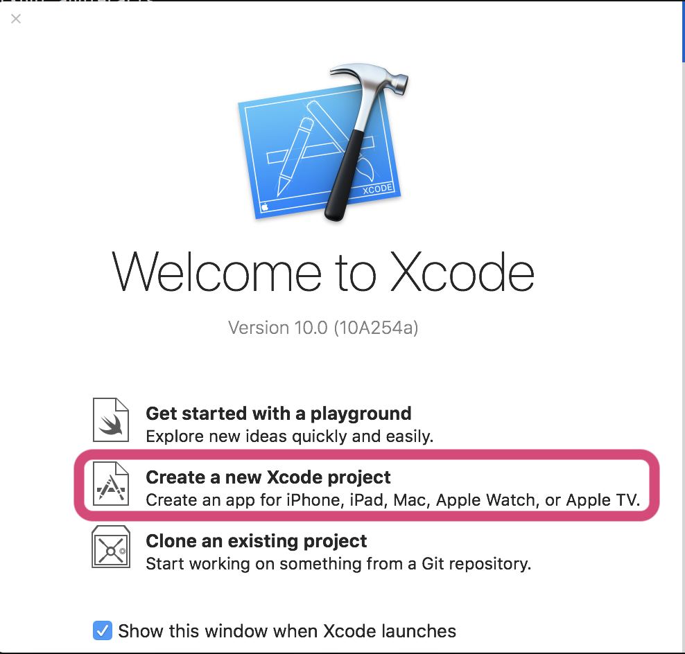
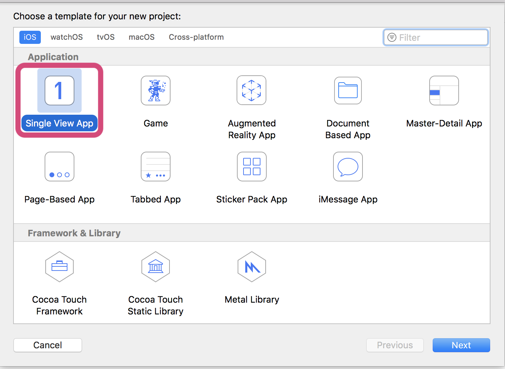
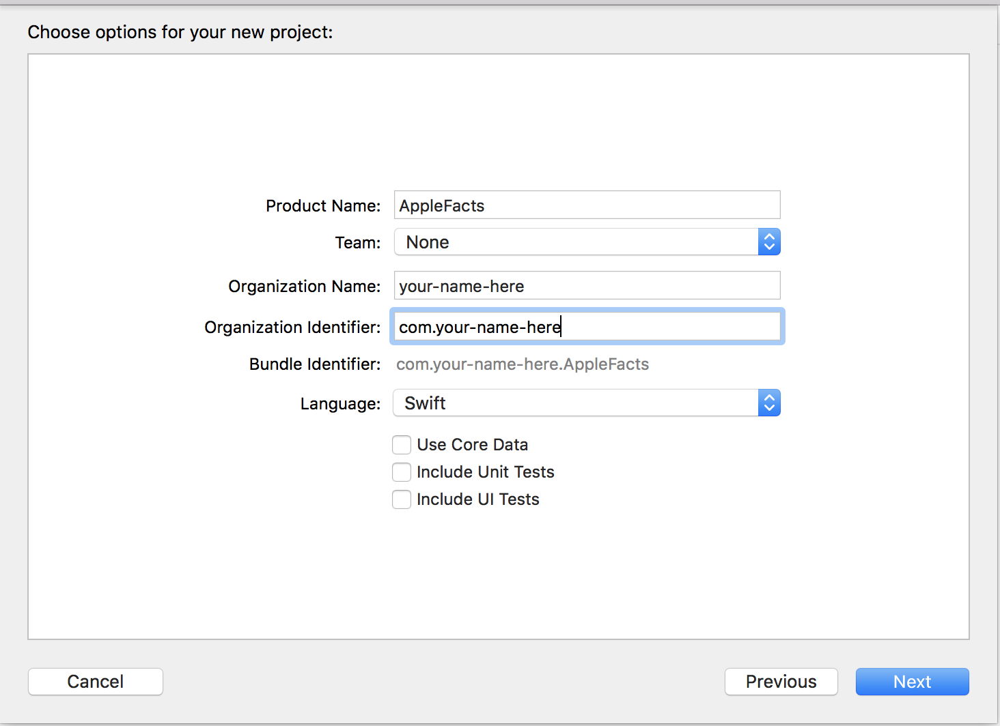

## Apple Facts

* Introduce Apple facts: Finished Product preview
* Do not eat disclaimer
* The aims (Steal from APPLE)
* Introduction: Most apps do not have a single screen blah
* Segue JOKE !
* Add single Apple image button
* Segue explanation to go to a detail view
* Navigation Controller explanation (push/pop stack of plates)
* Add Navigation controller to project
* Build up template of detail view controller (image, title, description) and explain constraints
* Passing information using prepare for Segue
* Adding more apple images and configuring their segues to detail view.

This is another series of introduction to iOS. This time we will introduce

### What are we going to build?

We'll be building a apple Facts app, where the user will see a list of Apple images and be able click on one and move to a single screen with more detail about that apple.

  

### Pre-requisites

In order to do iOS development, you will need a Mac.

Download and install Xcode from the App Store. This may take a while — its a big program.

### Creating a Project

##### 1. Open Xcode and click **Create a new Xcode project**.

  

##### 2. Select Single View Application from the **iOS > Application list**, and click **Next**

  

##### 3. Fill in the project details:

* **Product Name**: AppleFacts
* **Team**: None
* **Organization Name**: Whatever you want — your name is always a good fill-in
* **Organization Identifier**: com.(OrganizationName)

Make sure Swift is selected as the language, and Devices is set to Universal.

Untick the 3 boxes at the bottom.

Click Next

  
